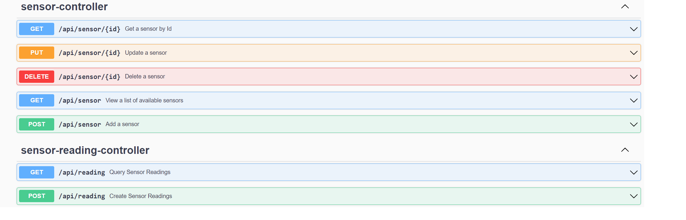
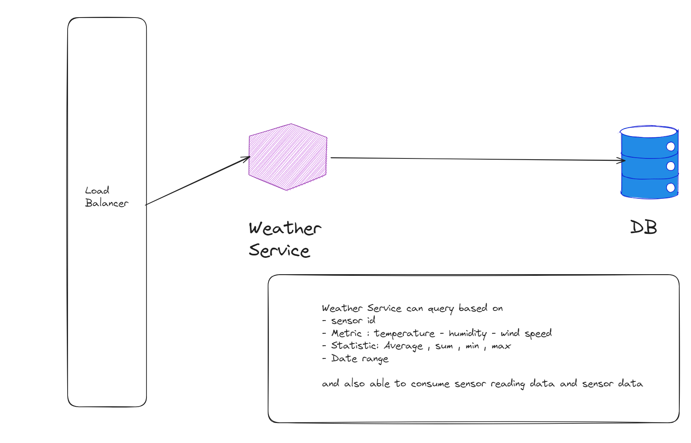

# Weather Service

## Introduction

Weather service is an open source platform that enable api for receives weather data from various sensors

## Usage
Please make sure you have docker installed in your environment to run this application with given samples
* Run `mvn install` to generate jar file.
* Run `make up` to start the application.
* Connect to the API using Postman on port 80.

## API Endpoints

| HTTP Verbs | Endpoints       | Action                              |
|------------|-----------------|-------------------------------------|
| POST       | /api/sensor     | Create sensor                       |
| GET        | /api/sensor/:id | Get sensor information for given id |
| GET        | /api/sensor/    | Get all sensors                     |
| PUT        | /api/sensor/:id | Update sensor for given id          |
| DELETE     | /api/sensor/:id | Delete sensor for given id          |

## API Usage (Swagger UI Documentation)
The API documentation can be found on Swagger UI. To view it, please visit: Swagger UI.

swagger.json: `http://127.0.0.1/api-docs`

swagger-ui: `http://127.0.0.1/swagger-ui.html`

## Database Selection

## Missing Parts

## Next Steps

## Technologies Used

### Spring-Boot
The Spring framework is dominating the java world for quite some time and it’s a very well-established framework Spring has the most significant community out of all frameworks and integrations with almost every third-party system.

Spring-Boot provides a simple way to create stand-alone, production-grade Spring-based applications. It is designed to simplify the bootstrapping and development of new Spring applications. Spring Boot also makes it easy to create production-ready applications by providing features such as embedded servers, configuration management, health checks, and security.

#### Why Spring-boot
* Documentation & Community support
* Wide range of features and plugins
* Developer experience
* Production-readiness: Provides features like health checks, metrics, and externalized configuration that make it easy to create production-ready applications.

### Spring Data JPA
Simplifying the database access layer by reducing the boilerplate code.

### Test Containers

Easy testing with real container images

### OpenAPI (Swagger)
Enabling seamless API documentation for better understanding and testing.

## Credits

Weather service is created and maintained by Anil Mercan

* I am open to suggestions, feel free to email mercanil@gmail.com

## Reference Documentation

For further reference, please consider the following sections:

* [Official Apache Maven documentation](https://maven.apache.org/guides/index.html)
* [Spring Boot Maven Plugin Reference Guide](https://docs.spring.io/spring-boot/docs/3.1.4/maven-plugin/reference/html/)
* [Spring Data JPA](https://docs.spring.io/spring-boot/docs/3.1.4/reference/htmlsingle/index.html#data.sql.jpa-and-spring-data)
* [Spring Web](https://docs.spring.io/spring-boot/docs/3.1.4/reference/htmlsingle/index.html#web)

## License
This project is available for use under the MIT License.
